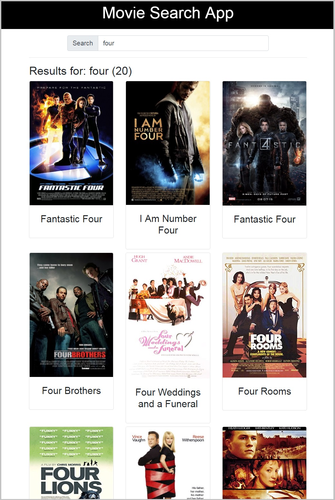

# Movie Search App

This is a simple React/Redux application that allows you to make a search query to the [OMDB](https://www.omdbapi.com/) Database, and returns a list of movie posters that matches the query term.

<p align="center">

</p>

## Get Started

##### For Development

1. Install and run [movie-app-server](https://github.com/iHani/movie-search-server)
2. Use `npm` or `yarn` to install and start the front-end development server:
* `git clone git@github.com:iHani/movie-search-app.git movie-search-app`
* `cd movie-search-app`
* `npm install`
* `npm start`

##### For production
Running the following will build the app for production to the `build` folder:

 * `npm run build`

##### Running tests
To run the test:

* `npm test`

## Backend Server

The API file [`MoviesAPI.js`](src/APIs/MoviesAPI.js) contains the methods we will need to perform necessary operations on the backend:

* [`queryMovies`](#queryMovies)
* [`refreshCache`](#refreshCache)

### `queryMovies`

Method Signature:

```js
queryMovies(query)
```

* query: `<String>`
* Returns a Promise which resolves to a JSON object containing a `totalResults: <Number>`, `Response:<Bool>`, `Search:<Array>`.

### `refreshCache`

Method Signature:

```js
refreshCache()
```

* Returns a Promise which resolves to a JSON object `allExistCacheRefreshed: true`

## About

This app was bootstrapped by [CRA](https://github.com/facebook/create-react-app), and used [Redux](https://redux.js.org/) for state management, [Redux Thunk](https://www.npmjs.com/package/redux-thunk) for asynchronous dispatching, and [Redis](https://redis.io/) as a caching layer. Jest & Enzyme were used for testing. The UI was built with [Bootstrap 4](https://getbootstrap.com/)

## License
MIT
